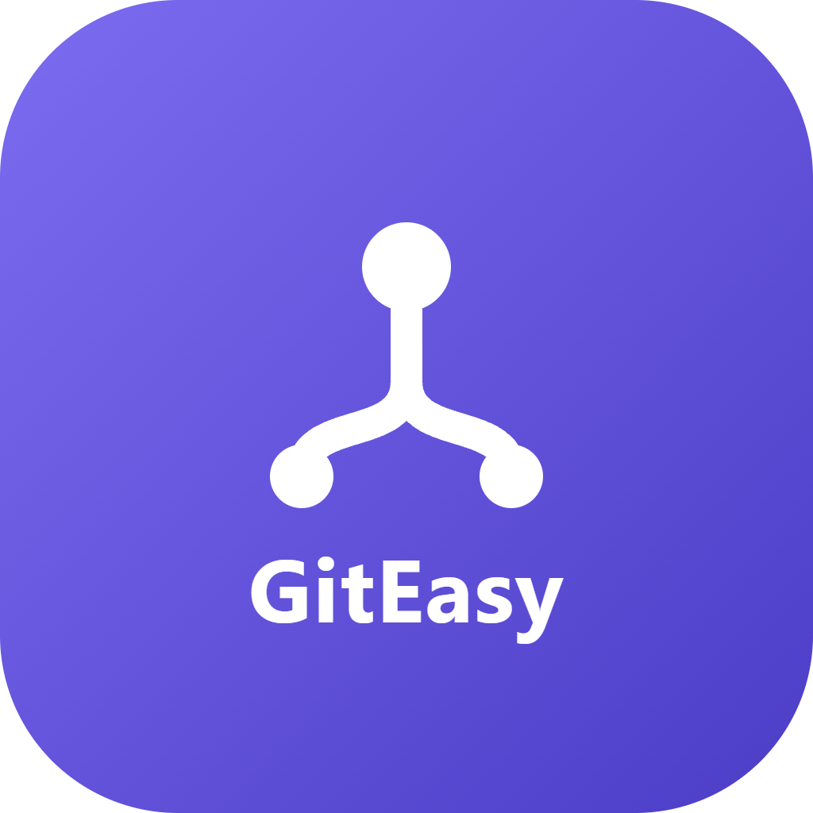

<div align="center">
  
  <p><strong>A Git client for people who haven't learned Git yet —<br />and a fast one for people who have.</strong></p>
</div>

---

Most beginner-friendly Git tools hide Git behind invented words. "Save to cloud." "Sync." "Backup." They get you through today and leave you stranded the first time a colleague asks whether you pushed.

GitEasy does the opposite. It uses the real vocabulary — commit, push, pull, branch, merge, rebase, upstream, remote — and then never leaves one of them unexplained. Every term carries a plain-English line underneath it and a `?` that opens the full definition, including the exact command GitEasy runs on your behalf.

Everything you learn here transfers. To the terminal, to your team, to every tutorial on the internet.

---

## Download

Grab the installer for your platform from the [**Releases**](https://github.com/daxpatel235/GitEasy/releases/latest) page.

| Platform | File |
| -------- | ---- |
| Windows  | `.exe` installer, or `.msi` for managed deployments |
| macOS    | `.dmg` |
| Linux    | `.AppImage` or `.deb` |

No account required. No sign-up wall. GitEasy is free, and it stays free.

---

## What it does

### On your computer

**Changes** — See every edited, added, deleted and renamed file at a glance. Tick the ones that belong together and commit just those, so one commit means one idea. Read the changed lines in place. Conventional-commit prefixes are one click away, and per-file discard is there when an experiment didn't work out.

**History** — Every commit on the branch, searchable and filterable. Revert a commit, copy one onto your branch, or open it on GitHub.

**Branches** — Create, switch, rename, merge and delete. Deleting counts your unpushed work first and tells you exactly what would be lost, because that's the mistake nobody recovers from on their own.

**Shelf** — Git's stash, named after what it actually does. Put unfinished work aside, get a clean project, and put it back whenever.

**Conflict resolver** — The two versions side by side, labelled by who wrote them, with a button per side. A raw conflict full of `<<<<<<<` markers is where most people give up and re-clone the repository. This is the screen that decides whether someone keeps using Git.

### On GitHub

**Sync** — Ahead and behind at a glance. Pull by merge or rebase, push, fetch, and manage multiple remotes.

**Sync fork** — Pull the original project's newest work into your copy. Forks don't update themselves, and this is the step people miss.

**Pull requests** — List, filter, open as draft or ready, and merge.

**Issues**, **Checks** (Actions runs, with re-run), and **Releases** (tags and published versions, with a semver-aware suggestion for the next one).

### Throughout

- **Ctrl + K** command palette, where every entry says in plain English what it will do — fast for experts, browsable for beginners.
- **Learn Git** — the whole glossary, a diagram of where your work lives, and six habits worth having.
- **Guard rails you can switch off** — warn before committing to the main branch, before committing very large files, and before committing anything that looks like a password.

---

## The two dialogs that matter

**Connecting.** Choosing a folder opens one dialog: *Git is connected*. It shows what was found — the folder, the remote, the original project if this is a fork — then asks the only question that matters: which branch do you want to work on? An existing one, or a new one and what it starts from.

One confirmation, at the moment it means something. No separate "you're all set" screen.

**Pushing.** The one step that leaves your machine always shows exactly what is about to become public, every changed line readable in place, before it goes.

---

## Keyboard shortcuts

| Shortcut | Action |
| -------- | ------ |
| `Ctrl + K` | Command palette |
| `Ctrl + Enter` | Commit |
| `Ctrl + Shift + P` | Push |
| `Ctrl + Shift + L` | Pull |
| `Ctrl + B` | New branch |
| `Ctrl + R` | Refresh from disk |
| `Ctrl + 1…9` | Jump to a screen |
| `Esc` | Close a dialog — never loses what you typed |

---

## Themes

Two independent axes, both in **Settings → Theme**:

- **Appearance** — Light or Dark.
- **Theme** — 14 palettes, including faithful ports of Nord, Catppuccin, Dracula, Gruvbox, Tokyo Night and Solarized, with hex values taken from each project's own reference.

Beyond the presets there's an **accent colour** (12 presets plus a free picker, which derives the hover shade and label colour from whatever you choose and warns if a colour would leave labels hard to read) and a **font** setting (7 pairings, each a UI face plus a matching monospace face).

That's 14 palettes × 2 modes × 7 fonts before custom accents, and every palette declares a complete token set for both modes independently — so no combination can render one theme's text on another theme's background.

---

## Privacy

GitEasy is local-first and quiet by design.

- Every local Git operation works with **no internet connection**. Committing, branching, history, the shelf — all of it.
- Only GitHub operations need the network.
- **Your password is never asked for or stored.** Signing in opens GitHub in your real browser through the official GitHub CLI, which keeps the token in your operating system's keychain. GitEasy only ever asks it who you are.
- No telemetry, no analytics, no phoning home.
- Git stays the source of truth for your repository. GitEasy's own database holds nothing but your project list and preferences.

---

## Built with

React, TypeScript and Vite for the interface. Rust and Tauri for the desktop shell. The real Git CLI underneath — GitEasy runs Git, it doesn't reimplement it.

## Building from source

```bash
npm install
npm run dev          # the interface in a browser
npm run tauri:dev    # the full desktop app (needs Rust)
```

Rust is required for the desktop build — install it from [rustup.rs](https://rustup.rs).

## Licence

[MIT](LICENSE) © Dax Patel
